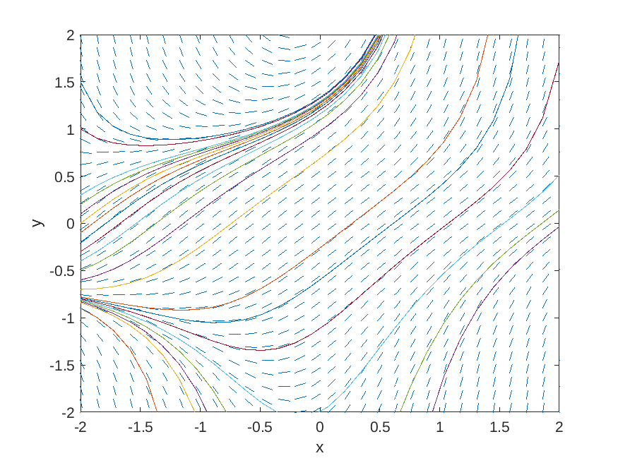

One of the most important ideas in the mathematical development of the theory of differential equations is the role of *geometry*.
Differential equations as a rule have a rich geometric theory, which at more advanced levels is captured by the theory of differential geometry.
For first-order differential equations, the main geometric tool for their study is called a slope field.

# Basics of Slope Fields

Given a first-order differential equation

$$y' = f(x,y),$$

the **slope field** (also called the **direction field**) of the equation is a graph where we consider a grid of points in the $$x,y$$-plane, and at each point we draw a little dash whose slope is the value of $$f$$ at the point.  

## Basic examples


**Example 1:**  The slope field of the differential equation

$$y' = xy$$

is given by

<p align="center"></p>

**Example 2:**  The slope field of the differential equation

$$y' = 1 + xy^2$$

is given by

<p align="center"></p>

## Making slope fields with MATLAB

Both of these plots were generating using MATLAB.
We first define some basic variables which determine the range of $$x$$ and
$$y$$ values we will consider, and how many grid points we will have.

```MATLAB
% define some fixed variables for all plots
nx = 30;        % number of grid points in x direction
ny = 30;        % number of grid points in y direction
xmin = -5.0;    % minimum x value
xmax =  5.0;    % maximum x value
ymin = -5.0;    % minimum y value
ymax =  5.0;    % maximum y value
```

We then use the *meshgrid* command to create matrices *X* and *Y* whose entries
are the $$x$$ and $$y$$ values at each of the grid points.

```MATLAB
% create nx-by-ny matrices whose entries are the x and y values
[X, Y] = meshgrid(linspace(xmin,xmax,nx),linspace(ymin,ymax,ny));
```

Now we want to create a function representing $$f(x,y)$$ in the differential equation.

```MATLAB
% plot the slope field for y'= xy
fun1 = @(x, y) (y.*x);
```

Then we want to encode the slopes of each grid point into a matrix *DYDX* and plot it using the *quiver* command.

```MATLAB
% calculate the slope field
DYDX = fun1(X, Y);
% put in unit vector form
DY = DYDX ./ sqrt(1 + DYDX.^2);
DX = ones(length(DY)) ./ sqrt(1 + DYDX.^2);
% plot the vectors
h = quiver(X, Y, DX, DY, (xmax-xmin)/nx);
set(h, "maxheadsize", 0.0);    % change 0.0 into another value to get arrows instead of dashes
```

Finally, we fix our x and y limits in the graph and label the axes.

```MATLAB
xlim([xmin,xmax])
ylim([ymin,ymax])
xlabel('x')
ylabel('y')
```

## Integral curves

Slope fields are connected to solutions of differential equations through the idea of integral curves.

An **integral curve** in a slope field is a curve in the $$x,y$$ plane with the property that at each point on the curve, the slope of the tangent line to the curve is equal to the slope of the direction field.

Intuitively, we can think about the slope field as the surface of a big pond.
The dashes indicate the direction the water is moving at each point.
So if a leaf falls into the pond at a particular point, it'll move in the direction of the current at each moment in time.
In this way it traces out the path of an integral curve.

:warning: This isn't quite right, since it ignores momentum.  However, if this are moving slowly enough it's a pretty accurate picture!

The equation of an integral curve *defines* a solution of the differential equation.
To see this, suppose that

$$y = h(x)$$

is the equation of a curve in the $$x,y$$-plane which is an integral curve for $$y' = f(x,y)$$.

Then the slope of the tangent line to the curve at $$(x,y)$$ is $$h'(x)$$, which must also be the same as $$f(x,y)$$.
This means

$$h'(x) = f(x,h(x)),$$ 

so that $$y=h(x)$$ is solution of the differential equation!
The next theorem summarizes this observation.

**Theorem:** Integral curves are graphs of solutions!

In particular, even when we can't actually solve the differential equation analytically, we can still get a good picture of what the solutions look like using slope fields.
This also suggests an important numerical method for numerically approximating solutions of first-order ODEs, which we will discuss later on.

For the second differential equation whose slope field is featured above, explicit solutions involve Airy functions of the first and second kind.
Even so, we can explicitly obtain solution curves by numerical means.
The results are pictured below.
Notice, each curve is always tangent to the slope field at each point.

<p align="center"></p>


## Existence and uniqueness

For any slope field, it seems to be the case that there are all kinds of integral curves, so any differential equation seems to have lots and lots of solutions.
What distinguishes one solution from another is an **initial condition**, where we specify a value that we want the solution $$y$$ to have at a particular $$x$$ value.
Equivalently, we specify a point we want our curve to pass through.
A differential equation, combined with an initial condition

$$y' = f(x,y),\ \ y(x_0) = y_0,$$

is called an **initial value problem**.
A fundamental question that arises in the study of differential equations is whether a particular initial value problem has a solution, and whether or not that solution is unique.
In the case that an initial value problem has a unique solution for some range of $$x$$-values around $$x_0$$, the problem is called **well-posed**.
Picard's Theorem gives us a sufficient condition for first order equations being well-posed.

**Picard's Theorem:**  Suppose that $$f(x,y)$$ and $$\frac{\partial f}{\partial y}$$ are both continuous in some rectangle $$R$$ containing the point $$(x_0,y_0)$$.
Then there exists an interval $$I$$ containing $$x_0$$ on which the initial value problem stated above has a unique solution.

Intuitively, this means that when our leaf touches down on the surface of the lake, the way it will move will be completely determined! At least for a little while...
Geometrically, this means that the integral curves we were drawing above can never intersect, except at points where $$f$$ or $$\partial f/\partial y$$ have discontinuities.

It's very important that both $$f$$ and $$f_y$$ are well-behaved, as the next example shows.

**Counter-example:**  Consider the initial value problem

$$y' = y^{1/3},\quad y(0) = 0.$$

This initial value problem has a solution $$y=(2x/3)^{3/2}$$.  It also has the constant solution $$y=0$$.  Thus there isn't a unique solution and the problem is not well-posed.

### Additional resources

The MATLAB script used to generate above images can be found here:
* [topic_001_slope_field.m](matlab/topic_001_slope_field.m)


