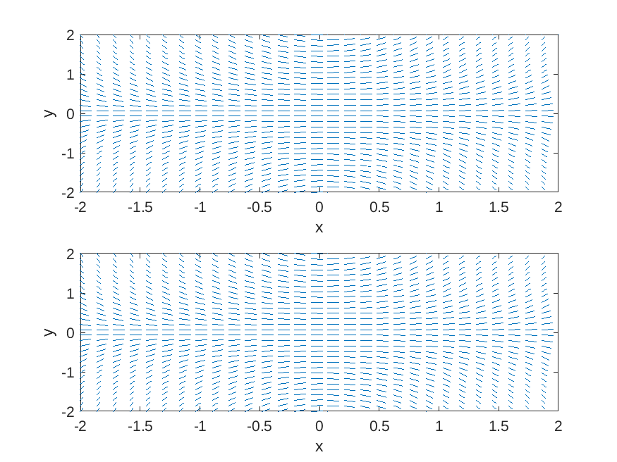
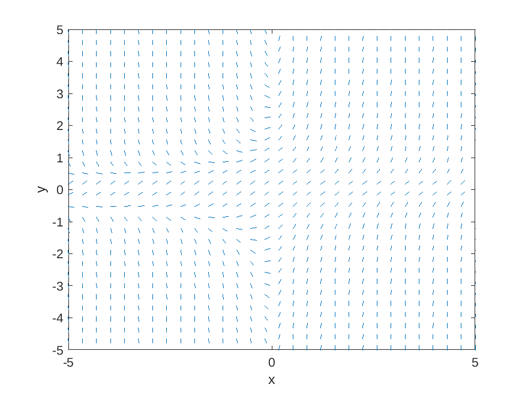

One of the most important ideas in the mathematical development of the theory of differential equations is the role of *geometry*.
Differential equations as a rule have a rich geometric theory, which at more advanced levels is captured by the theory of differential geometry.
For first-order differential equations, the main geometric tool for their study is called a slope field.

# Basics of Slope Fields

Given a first-order differential equation

$$y' = f(x,y),$$

the **slope field** (also called the **direction field**) of the equation is a graph where we consider a grid of points in the $$x,y$$-plane, and at each point we draw a little dash whose slope is the value of $$f$$ at the point.  

For example, the slope field of the differential equation

$$y' = xy$$

is given by

<p align="center"></p>

Likewise, the slope field for the equation

$$y' = 1 + xy^2$$

is given by

<p align="center"></p>

## Making slope fields with MATLAB

Both of these plots were generating using MATLAB.
We first define some basic variables which determine the range of $$x$$ and
$$y$$ values we will consider, and how many grid points we will have.

```MATLAB
% define some fixed variables for all plots
nx = 30;        % number of grid points in x direction
ny = 30;        % number of grid points in y direction
xmin = -5.0;    % minimum x value
xmax =  5.0;    % maximum x value
ymin = -5.0;    % minimum y value
ymax =  5.0;    % maximum y value
```

We then use the *meshgrid* command to create matrices *X* and *Y* whose entries
are the $$x$$ and $$y$$ values at each of the grid points.

```MATLAB
% create nx-by-ny matrices whose entries are the x and y values
[X, Y] = meshgrid(linspace(xmin,xmax,nx),linspace(ymin,ymax,ny));
```

Now we want to create a function representing $$f(x,y)$$ in the differential equation.

```MATLAB
% plot the slope field for y'= xy
fun1 = @(x, y) (y.*x);
```

Then we want to encode the slopes of each grid point into a matrix *DYDX* and plot it using the *quiver* command.

```MATLAB
% calculate the slope field
DYDX = fun1(X, Y);
% put in unit vector form
DY = DYDX ./ sqrt(1 + DYDX.^2);
DX = ones(length(DY)) ./ sqrt(1 + DYDX.^2);
% plot the vectors
h = quiver(X, Y, DX, DY, (xmax-xmin)/nx);
set(h, "maxheadsize", 0.0);    % change 0.0 into another value to get arrows instead of dashes
```

Finally, we fix our x and y limits in the graph and label the axes.

```MATLAB
xlim([xmin,xmax])
ylim([ymin,ymax])
xlabel('x')
ylabel('y')
```

## Integral curves


