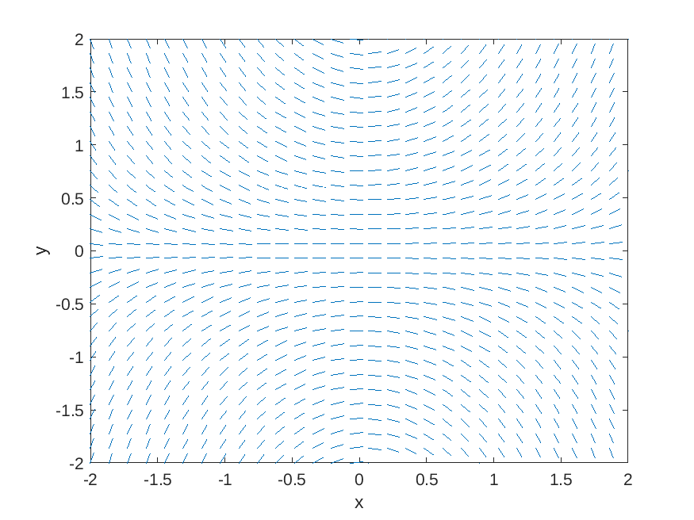
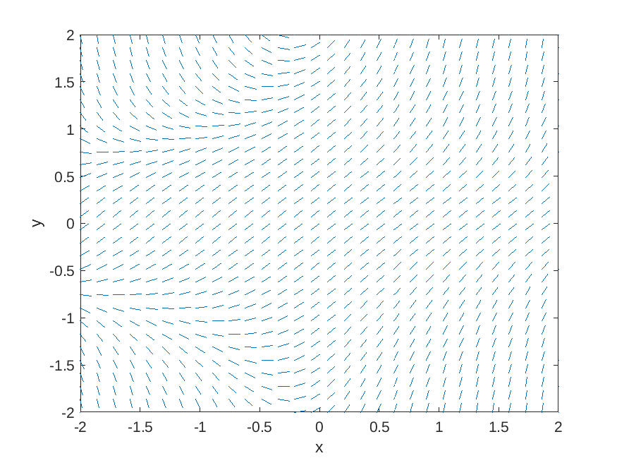

One of the most important ideas in the mathematical development of the theory of differential equations is the role of *geometry*.
Differential equations as a rule have a rich geometric theory, which at more advanced levels is captured by the theory of differential geometry.
For first-order differential equations, the main geometric tool for their study is called a slope field.

# Basics of Slope Fields

Given a first-order differential equation

$$y' = f(x,y),$$

the **slope field** (also called the **direction field**) of the equation is a graph where we consider a grid of points in the $$x,y$$-plane, and at each point we draw a little dash whose slope is the value of $$f$$ at the point.  

For example, the slope field of the differential equation

$$y' = xy$$

is given by

Likewise, the slope field for the equation

$$y' = 1 + xy^2$$

is given by

## Examples

## Integral curves

