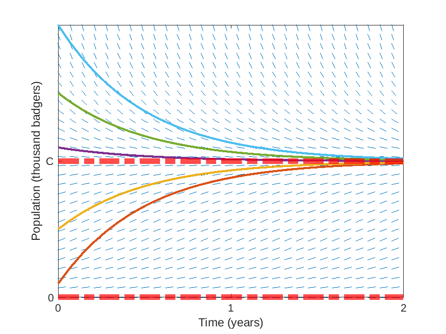

One important special case of separable equations is **autonomous equations**, ie. equtions of the form

$$\frac{dy}{dt} = g(y).$$

Intuitively, if the variable $$t$$ represents time, then these equations are
autonomous in the sense that the way they evolve depends only on the value of
the unknown function itself, rather than what time it is.
Many population models and physical phenomena like Newton's law of cooling are
autonomous, since when perform an experiment the time we start the experiment
shouldn't affect the outcome.
Time dependence would be indicative of something outside of the experiment
influencing things.

# Qualitative solutions

In theory, solving an autonomous equation is easy!
We just separate and integrate

$$\int \frac{1}{g(y)}dy = t + C.$$

However, it can very easily be the case that the function $$g(y)$$ is
complicated enough that the integral is hard to do, or even impossible to do, by hand.
In this case, we can still get a good qualitative idea of the shape of
solutions.
In particular, we can decipher the asymptotic behaviour of solutions over time.
The key to this is the notion of equilibrium values.

**Note:** Even if we do calculate the solutions, getting qualitative behavior like asymptotic behavior from the values of the solutions themselves might be more complicated than with the method outlined here!

## Equilibrium values

An **equilibrium value** of a homogeneous differential equation is a real number $$c$$ with the property that $$g(c)=0.$$
The main thing to observe about equilibrium values is that they define solutions of the differential equation!
In fact, if $$c$$ is an equilibrium value, then the constant function $$y(x) = c$$ satisfies

$$y' = 0 = g(c) = g(y),$$

and therefore solves the differential equation.
In other words, if we start at an equilibrium value then as time moves on, we stay at that equilibrium value.

**Example:**

Consider the logistic equation modeling the population $$y$$ of a colony of honey badgers on an island with growth rate $$k$$ and carrying capacity $$C$$

$$y' = ky(1-y/C).$$

The equilibrium values of this equation are $$y = 0$$ and $$y=C$$.
This means if we start with an initial population of $$0$$ badgers, then we'll remain with no badgers (not too surprising!).
Alternatively if we start with a population of $$C$$ badgers, then our population will forever remain at $$C$$.

## Stability

What happens if we start near an equilibrium value, but not at it?  What happens to our solution is determined by the **stability** of the equilibrium value.
An equilibrium value is called
* **stable** if solutions that start close enough to it on both sides converge toward it as time increases
* **semistable** if solutions that start close enough to it on one side converge toward it, while on the other side they move away
* **unstable** if solutions that start close enough to it on both sides move away

**Example:**

For the logistic equation, the equilibrium value $$0$$ is *unstable*.
If the population is greater than $$0$$, the badgers enthusiastically procreate until the population reaches the carrying capacity of the island $$C$$.
Likewise, the population is less than $$0$$ (not a realistic scenario!) then the population of badgers breaks away toward $$-\infty$$.
On the other hand, the equilibrium value $$C$$ is *stable* since if the population is above the carrying capacity, it dies off until it gets close to $$C$$.
Likewise, if it's beween $$0$$ and $$C$$, it increases until it reaches $$C$$.

Mathematically, we can determine the stability of an equilibrium value using the following theorem.

**Theorem:** Suppose $$g(y)$$ is continuously differentiable and $$c$$ is real number with $$g(c) = 0$$. Then
* if the function $$g(y)$$ goes from positive to negative at $$c$$, then $$c$$ is **stable**
* if the function $$g(y)$$ goes from negative to positive at $$c$$, then $$c$$ is **stable**
* if $$g(y)$$ has the same sign both above and below $$c$$, then $$c$$ is **semistable**.

## Phase diagrams

The figure featured above is an example of a **phase diagram**.
It features equilibrium values as dashed lines, along with their stability by sketching solutions either converging to or away from equilibria.

Producing this kind of graphic always follows the same basic steps
1. Solve $$g(y) = 0$$ for the equilibrium values.
2. Between each equilibrium point, determine the sign of $$g(y)$$.
3. Use (2) to classify the stability of each equilibrium value.
4. Draw in the equilibrium values and some curves between each value which asymptotically approach equilibria or diverge to plus or minus infinity.

:warning: Remember, in your sketches the test curves can never cross each other or the equilibrium lines.  This is because of uniqueness of solutions!

**Example:**

Consider the differential equation

$$y' = (y-1)y(y+1)(y+2)^2.$$

The equilibrium values are $$-2,-1,0,$$ and $$1$$.
We outline the changes in the sign in the chart below.

| y |sign|
|---|----|
|\| |POS | 
| 1 |    |
|\| |NEG | 
| 0 |    |
|\| |POS | 
|-1 |    |
|\| |NEG | 
|-2 |    |
|\| |NEG |

### Additional resources

The MATLAB script used to generate above images can be found here:
* [topic_004_autonomous.m](matlab/topic_004_autonomous.m)
