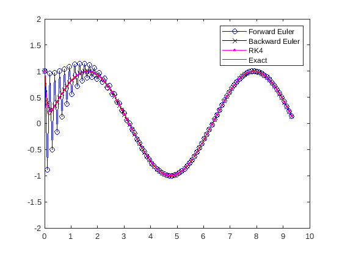

Most differential equtions that we meet in the wild don't have nice, explicit analyic solutions.
Instead, we use computers to obtain approximate **numerical solutions**.
The history of numerical solutions of PDEs goes all the way back to Euler in
1768, so needless to say there has been plenty of time to develop all sorts of
interesting techniques.
We will discuss three such popular techniques here.


## Forward Euler

The simplest numerical method of solving an IVP

$$y' = f(t,y),\ \ \ y(t_0) = y_0$$

relies on the idea that derivatives are limits of difference quotients, so that for $$h > 0$$ small enough

$$y'(t) \approx \frac{y(t + h) - y(t)}{h}.$$

This may be rewritten as

$$y(t+h)\approx y(t) + hf(t,y(t+h)).$$

This gives us a recurrence relation for a sequence $$y_n$$:

$$y_n = y_{n-1} + hf(t_{n-1},y_{n-1}),\quad n\geq 1.$$

The choice of $$h$$ is called the **step size**.
When the step size is sufficiently small, the values of $$y_n$$ should approximate the values of an exact solution $$y(t)$$ of the IVP at the times $$t_n$$.
In other words $$y_n\approx y(t_n)$$.
This method is called the **forward Euler method**.

### Basic example

Consider the initial value problem

$$y' + ay = a\sin(t),\quad y(0) = 1.$$

This is a linear differential equation, so we know how to solve it exactly.
Doing so, we get

$$y = \frac{a^2+a+1}{a^2+1}e^{-at} + \frac{a^2}{a^2+1}\sin(t) - \frac{a}{a^2+1}\cos(t).$$

This makes this a good IVP to use to verify the accuracy of our methods.
Our update equation says

$$y_n = y_{n-1} + khy_{n-1}.$$

The Forward Euler method is easy to program in MATLAB.
To start oout, we define the variables we care about:

```Matlab
% Define basic parameters

t0 = 0;       % initial time
t1 = 3*pi;    % final   time
y0 = 1;       % initial y value
nsteps = 100; % number of time steps
a = 2;        % parameter

h = (t1-t0)/nsteps;
```

**Note:** Above, We just picked some value for $$a$$.
This is something that we can modify and observe the effect on our solution.

We also create arrays to hold our time and our approximate solutions

```Matlab
% Create arrays to hold time and y values
t = zeros([nsteps,1]);
y = zeros([nsteps,1]);  % approx with Forward euler
```

Then the Forward Euler algorithm is implemented with a *for loop*.

```Matlab
% run Forward Euler
t(1) = t0;    % initial condition
y(1) = y0;    % initial condition
for k=2:nsteps
  t(k) = t(k-1) + h;
  y(k) = y(k-1) + h*a*(sin(t(k-1))-y(k-1));
end
```

We can plt the result of this against our actual solution using the following code.

```Matlab
% define actual solution
ytruth = @(t) ((a^2+a+1)*exp(-a*t) + a^2*sin(t) - a*cos(t))/(1+a^2);

% plot approximate solution
plot(t,y,'bo-')
hold on
% plot actual solution
plot(t,ytruth(t),'r-')

% add legend, title, labels
xlabel('t')
ylabel('y')
title('Numerical Approximation')
legend('Forward Euler', 'exact solution')
```

## Backward Euler

Sometimes ODEs exhibit **stiffness**, where in order for a numerical method like Euler's method to be accurate, the step size $$h$$ must be taken to be extremely small.
This happens for large values of $$a$$ in the previous example.
The problem is that the exact solution has components which decay rapidly with time $$t$$.
In order to get an accurate solution, the time step $$h$$ has to be taken to be extremely small relative to the actual time scales of interest.
This is undesireable, since it tends to dramatically increase the required computation time.

To fix this, we modify Euler's method in a subtle but important way.
To solve the IVP

$$y' = f(t,y),\ \ \ y(t_0) = y_0$$

we use the fact that

$$y'(t+h) \approx \frac{y(t + h) - y(t)}{h},$$

leading to the recursion relation

$$y_{n} = y_{n-1} + hf(t_{n},y_{n}),\quad n\geq 1.$$

Note that this means to figure out $$y_{n+1}$$, we will need to solve the above equation.
Often this cannot be done algebraically, but we can still do it numerically using Newton's method from calculus.
This method is called **backwards Euler**.

The innovation here is like your a dog chasing a squirrel at the park.
The dog can be faster, but squirrels are notoriously squirrely and make abrupt turns on small time scales.
If the dog always runs at  where the squirrel is when it runs forward it will miss.  If it runs to where it predicts the squirrel will be next, it will do much better!
This is what we're doing with the above modification.
Forwards Euler takes into account what the derivative is currently.
Backwards Euler looks at what the derivative will be in the future.

Note, however, sometimes its still better to use forward Euler since
1. it is simpler to code and understand, and
2. it may be faster if solving for $$y_{n+1}$$ using Newton's method is prohibitively slow.


### Basic example

Using the same initial value problem as before

$$y' = ky,\quad y(0) = 1.$$

However this time we are using the update

$$y_n = y_{n-1} + ha(\sin(t_n)-y_n).$$

Solving this for $$y_n$$, we get

$$y_n = \frac{1}{1+ha}\left(y_{n-1} + ha\sin(t_n)\right).$$

```Matlab
% run Backward Euler

t(1) = t0;    % initial condition
z(1) = y0;    % initial condition
for k=2:nsteps
  t(k) = t(k-1) + h;
  z(k) = (z(k-1) + h*a*sin(t(k)))/(1+h*a);
end
```

## Runge-Kutta

One of the most popular algorithms for solving ODEs numerically is fourth-order Runge-Kutta (RK4).

The premise of Runge-Kutta methods is to use multiple *intermediate steps* between each full time step to obtain an estimate of the next value of $$y$$ at the next stage that will have a higher degree of accuracy.

This has the positive benefit of being much more accurate than a basic method like Forward Euler.  However, it still can have problems:
* it can still suffer from stiffness issues (see implicit or adaptive RK4),
* it is more laborious to calculate by hand (not an issue with a computer), and
* if evaluating the function $$f(x)$$ takes a long time, it might end up being slow.

Barring these issues, RK4 is a good go-to method for a wide range of ODEs.
The algorithm is straightforward to implement.
For each step, we calculate for quantities $$k_1,\dots, k_4$$ given by

$$\begin{align}
  k_1 &= hf(t_{k-1},y_{k-1}),
  k_2 &= hf(t_{k-1} + h/2, y_{k-1} + k_1/2),
  k_3 &= hf(t_{k-1} + h/2, y_{k-1} + k_2/2),
  k_4 &= hf(t_{k-1} + h, y_{k-1} + k_3).
\end{align}$$

Then our update is

$$y_k = y_{k-1} + \frac{1}{6}(k_1 + 2k_2 + 2k_3 + k_4).$$

### Basic example

Using the same initial value problem as before

```Matlab
% run RK4

t(1) = t0;    % initial condition
w(1) = y0;    % initial condition

f = @(t,y) (a*sin(t)-a*y);
for k=2:nsteps
  t(k) = t(k-1) + h;
  k1 = h*f(t(k-1),w(k-1));
  k2 = h*f(t(k-1) + h/2, w(k-1) + k1/2);
  k3 = h*f(t(k-1) + h/2, w(k-1) + k2/2);
  k4 = h*f(t(k-1) + h, w(k-1) + k3);
  w(k) = w(k-1) + (k1 + 2*k2 + 2*k3 + k4)/6;
end
```

A comparison of all three of these methods for $$a = 20$$ with $$100$$ time steps in the interval $$[0,3\pi]$$ is pictured below.

<p align="center"></p>

The Forward Euler features the dog-chasing-squirrel type stepping errors at the beginning.  The Backward Euler fixes this, and RK4 is slightly more accurate than RK4 here.


### Additional resources

The MATLAB script used to generate above images can be found here:
* [topic_009_numerical_mthods.m](matlab/topic_009_numerical_methods.m)


