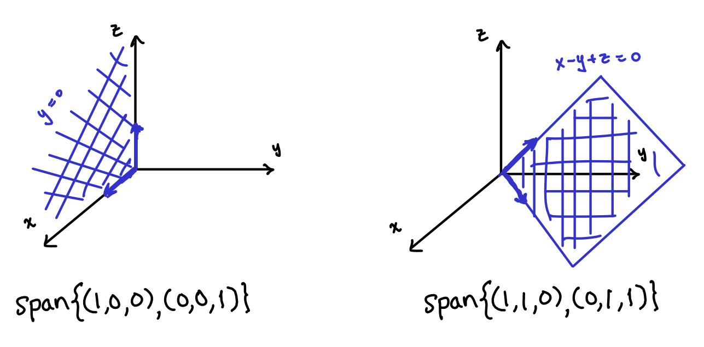

A vector space $$V$$ always has scalar multiplication and vector addition, so by combining these two operations we have a perfect way to start to create new vectors out of old ones.
More formally, these combinations of vector addition and scalar multiplicationo are called linear combinations.
A **linear combination** of a collection of vectors $$\mathbf u_1,\mathbf u_2,\dots,\mathbf u_n$$ is a vector of the form

$$a_1\mathbf u_1 + a_2\mathbf u_2 + \dots + a_n\mathbf u_n.$$

The set of all such linear combinations is called the **span** of $$\{\mathbf u_1,\dots,\mathbf u_n\}$$ and is denoted by

$$\text{span}\{\mathbf u_1,\dots,\mathbf u_n\} = \{a_1\mathbf u_1 + \dots + a_n\mathbf u_n: a_1,\dots, a_n\in\mathbb{R}\}.$$

**Theorem:** The span of a collection of vectors in $$V$$ is a subspace of $$V$$.

In the special case that

$$V = \text{span}\{\mathbf u_1,\dots,\mathbf u_n\}$$, we call $$\{\mathbf u_1,\dots,\mathbf u_n\}$$ a **spanning set** for $$V$$.
 

**Example:** The set of vectors

$$\left\lbrace\binom{1}{0},\binom{0}{1}\right\rbrace$$

is a spanning set for the vector space of all $$2\times 1$$ column vectors.

**Example:** The set of vectors $$\{\mathbf e_1,\mathbf e_2,\dots,\mathbf e_n\}$$
is a spanning set for the vector space of all $$n\times 1$$ column vectors,
where here 

$$\mathbf e_j = \left(\begin{array}{c}0\\\vdots\\0\\1\\0\\\vdots\\0\end{array}\right).$$

is the column vector with a $$1$$ in the $$j$$'th spot and zeros elsewhere.  This spanning set is called the **standard basis**.

**Example:** Let $$V$$ be the set of all polynomials of degree at most $$3$$.  Then $$V$$ is a vector space and 

$$\{1,x,x^2,x^3\}$$

$$\{1, x, 2x^2 -1, x^3 + x\}$$

$$\{1, 2, 3, (x+1)^2, (x+2)^2, x^3 + 3x + 1\}$$

are all spanning sets for $$V$$.

## Spans in three dimensions

**Example:** In $$\mathbb R^3$$, the dimension of everything is small enough that we can draw pictures.
The span of the set $$\{(1,0,0),(0,0,1)\}$$ consists of all linear combinations

$$\{a(1,0,0) + b(0,0,1): a,b\in\mathbb{R}\} = \{(a,0,b): a,b\in\mathbb{R}\}.$$

This is the set of all points $$(x,y,z)$$ in $$\mathbb R^3$$ where $$y=0$$.  Put another way, it's the $$x,z$$-plane!

The span of the set $$\{(1,1,0),(0,1,1)\}$$ consists of all linear combinations

$$\{a(1,1,0) + b(0,1,1): a,b\in\mathbb{R}\} = \{(a,a+b,b): a,b\in\mathbb{R}\}.$$

This is set of all points $$(x,y,z)$$ in $$\mathbb R^3$$ where $$y=x+z$$.  In other words, it is the plane $$x-y+z=0$$.

Geometrically, we can think about the span of a set $$S$$ of vectors in $$\mathbb{R}^3$$ as a kind of alien space ship that can travel in three dimensions.
However, at any given time it is only able to travel in one of the directions of the vectors in $$S$$.
Then I can switch directions and starting from my current position, travel the direction of some other vector in my set $$S$$.
If there aren't enough interesting directions in $$S$$ to choose from, the space ship might not be able to reach everywhere.

## More complicated spans

Oftentimes, we end up needing to consider spans of vectors in more complicated vector spaces.
Instead of drawing the span, our task is to instead find a nice way of describing or *characterizing* the span.
Consider, for example the set of $$3\times 3$$ **permutation matrices**
$$\left\lbrace
\left(\begin{array}{ccc} 1 & 0 & 0 \\ 0 & 1 & 0\\ 0 & 0 & 1\end{array}\right),
\left(\begin{array}{ccc} 1 & 0 & 0 \\ 0 & 0 & 1\\ 0 & 1 & 0\end{array}\right),
\left(\begin{array}{ccc} 0 & 1 & 0 \\ 1 & 0 & 0\\ 0 & 0 & 1\end{array}\right),
\left(\begin{array}{ccc} 0 & 1 & 0 \\ 0 & 0 & 1\\ 1 & 0 & 0\end{array}\right),
\left(\begin{array}{ccc} 0 & 0 & 1 \\ 1 & 0 & 0\\ 0 & 1 & 0\end{array}\right),
\left(\begin{array}{ccc} 0 & 0 & 1 \\ 0 & 1 & 0\\ 1 & 0 & 0\end{array}\right)
\right\rbrace.$$

Is there a nice way to describe the *span* of these matrices in the vector space $$M_3(\mathbb{R})$$ of all $$3\times 3$$ matrices?
We can start to explore this question by taking an arbitrary linear combination of the six matrices above, leading to the matrix

$$
\left(\begin{array}{ccc} a+b & c+d & e+f \\ c+e & a+f & d+b\\ d+f & b+e & a+c\end{array}\right),
$$

where $$a,b,c,d,e,f\in\mathbb{R}$$.
Notice that the sum of each row and each column always adds up to $$a+b+c+d+e+f$$.
It turns out that this characterizes the matrices in question.

**Prop:** The span of the $$3\times 3$$ permutation matrices consist of all $$3\times 3$$ matrices whose row and column sums are all equal.

